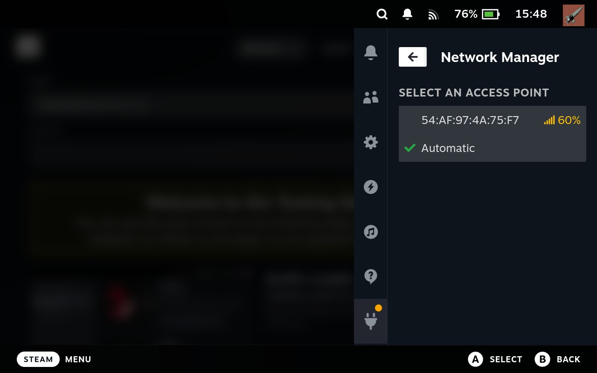

# Network Manager

Configure additional network settings which aren't available through the Gaming Mode GUI.
Currently, the only additional setting is selecting which access point is used for mesh networks.
This may be useful when streaming games to prevent stuttering.

